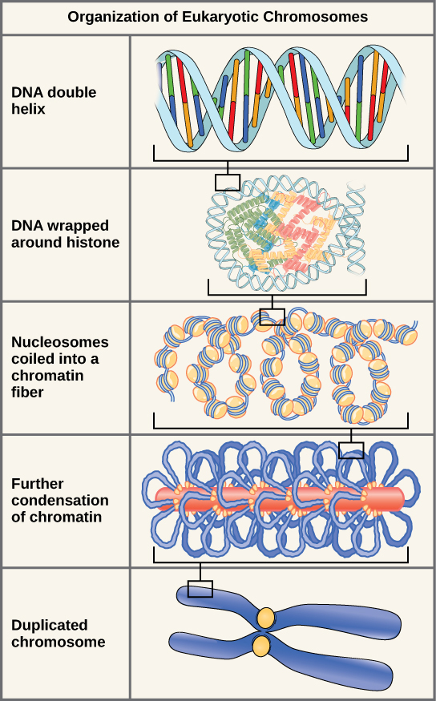
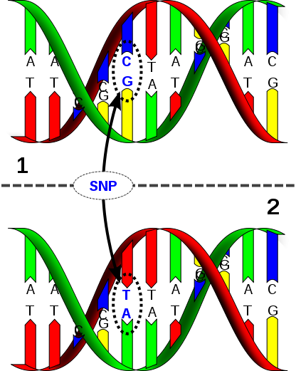
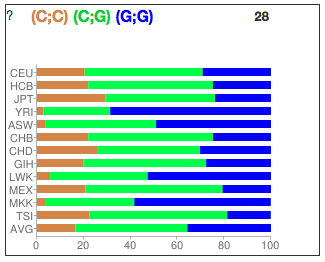
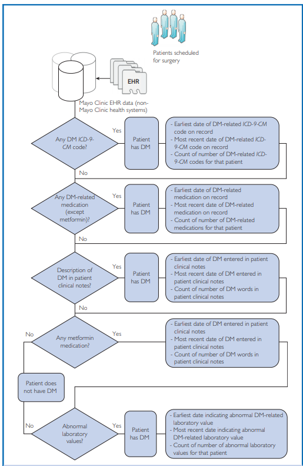
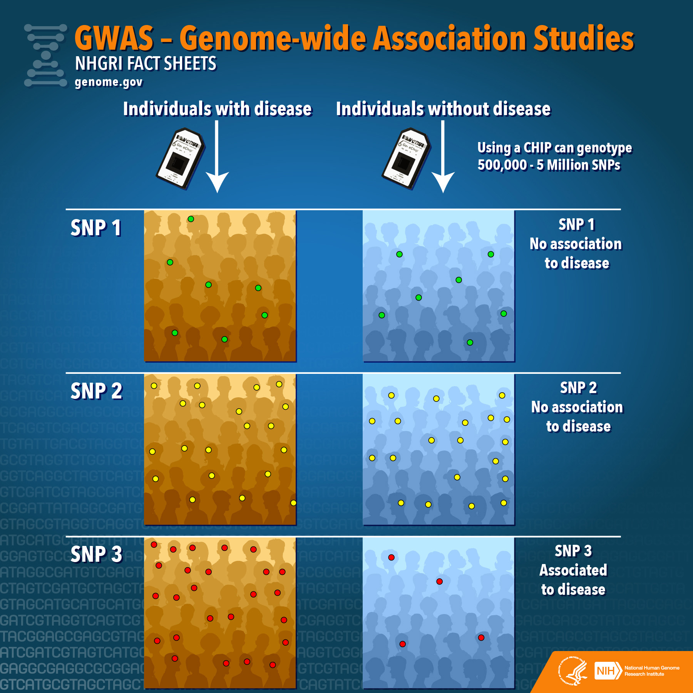
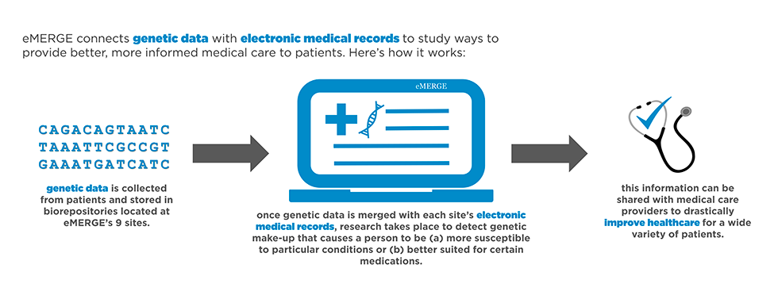
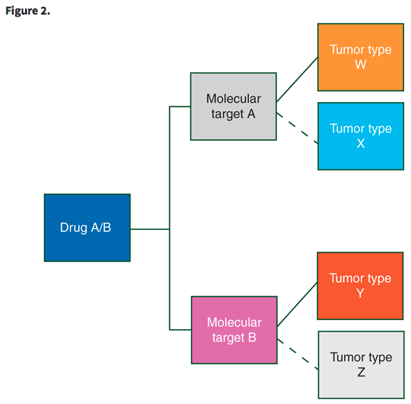
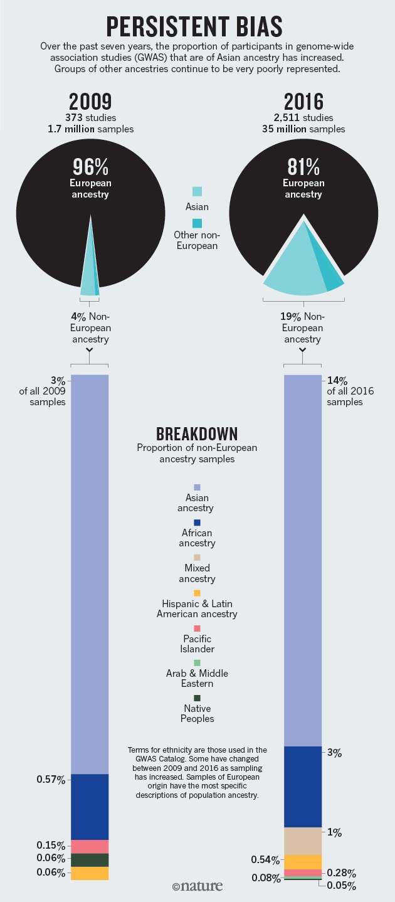

## Before we get started

For those interested in reproducibility:

- [Good Enough Practices in Scientific Computing](https://journals.plos.org/ploscompbiol/article?id=10.1371/journal.pcbi.1005510)
- [Reproducible Research in Statistics](https://rpubs.com/minnier/repro-bsr-2016-06)
- Literate computing: [Intro to RMarkdown](https://rpubs.com/brandonkopp/RMarkdown)


## Actionable Variants

  + What are they?
  + How do we find them? 
  + How will they be used?

## Genome Wide Association Studies (GWAS)

Integration of EHR data with genomic information

  + Phenotype (disease of interest)
  + Genotype (genetic variation)

Research question: is a particular genomic variant associated with Diabetes?

## DNA Structure



https://cnx.org/contents/8v2Xzdco@3/The-Structure-of-DNA

## What is a SNP?

A SNP (Single Nucelotide Polymorphism) is a single base-pair location in the genome where we observe variation across a population.

We need two pieces of information to locate a snp: 

1. the chromosome it's on, and 
2. the linear position on the chromosome.



Snp Image by David Hall / CC Licensed

## Parents and Genetics

Because we have two chromosomes (one from each parent), we will have two copies (values) at any SNP. Each of these copies is called an *allele*.

For example: 

- if my dad gave me a copy (allele) with an A, 
- and my mom gave me a copy (allele) with a G, 
- my genotype at that SNP location would be AG.

## SNP Frequencies

We classify the different genotypes based on how frequently they are observed in the population. 

Nomenclature: if a genotype is observed most of the time, we term that genotype the *wild type* (WT). The other genotype is called the *variant*, and by definition occurs less than the wild type. 

Based on population studies, we can see that genotype frequencies vary by racial population. Is this reflected in our genotype data?

- CEU = European Ancestry, YRI = African Ancestry from Nigeria



## Phenotype

  + Disease of Interest, or Outcome of Interest
  + Type 2 Diabetes?
    + How do we pull this information out of an EHR?
    + Phenotyping algorithms



https://phekb.org/sites/phenotype/files/1-s2.0-S2542454817300085-main.pdf

## Association


https://www.genome.gov/20019523/genomewide-association-studies-fact-sheet/

## What is a variant and what is a mutation?

  * Common in population = variant
  * Rare in population = mutation

## eMERGE


https://phekb.org/network-associations/emerge

## Acting on a Variant

If a SNP is associated with a disease, can we provide clinical care to target it?

What does it take to be an actionable variant?

  + Common Variant in Patient Population
  + Clear Association with Disease
  + Targeted Drug Treatment
  

## Basket Trials



## Bringing Everything Together

  + **Context:** How do we deliver information to clinicians at the right time and place?
  + **Quantity:** How can we summarize groups of variants and their effect on patients?
  + **Rarity:** How do we treat very rare mutations? 
  + **Privacy:** How do we protect genetic information about patients?

## Equity

Way too much bias towards European/Caucasians in GWAS! We can do better in recruiting diverse populations!

+ [Genomic Analysis Reveals Why Asthma Inhalers Fail Minority Children](https://www.ucsf.edu/news/2018/03/410041/genomic-analysis-reveals-why-asthma-inhalers-fail-minority-children)
+ [Genomics is Failing on Diversity](https://www.nature.com/news/genomics-is-failing-on-diversity-1.20759)]

```{r}

```

## Discussion questions

1) What is the difference between a Basket Trial and an Umbrella Trial? List one pro and con for both of these trial types as outlined in the Renfro et al paper.
2) How was the 47 gene panel incorporated into the clinical workflow in the Hamblin, et al paper?
3) How would you deliver actionable variant information to a clinician? What kinds of context and knowledge will they need to incorporate this information into their clinical decision making?
